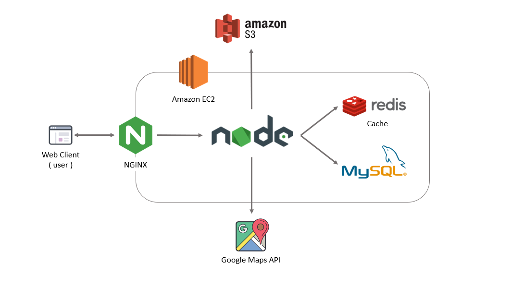
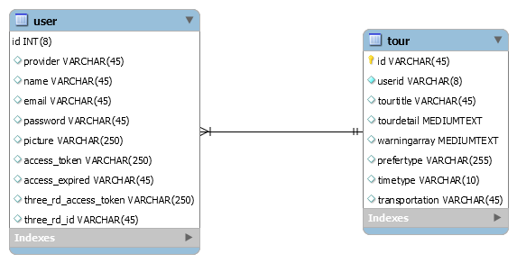
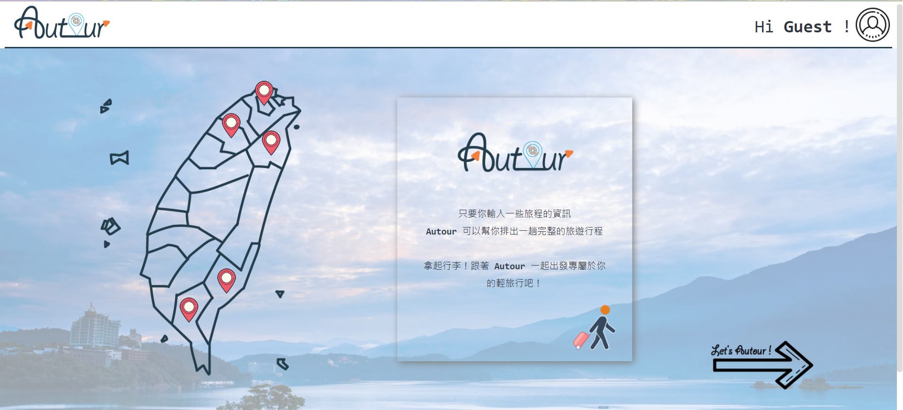
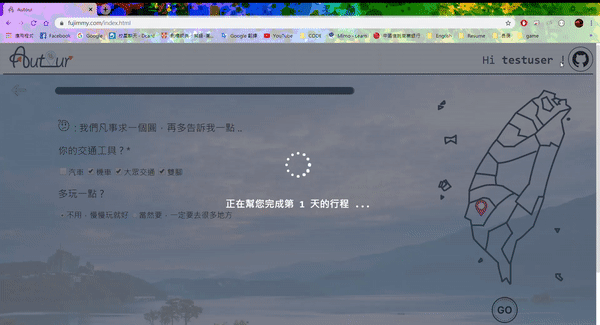
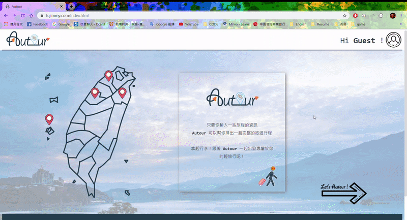

# Autour

Autour can arrange a whole travel schedule automatically ! As long as you enter some basic infomation of your travel , you'll get a complete travel schedule.
Website URL: https://fujimmy.com

## Table of Contents
* [Technologies](#technologies)
* [Architecture](#architecture)
* [Database Schema](#database-schema)
* [Main Features](#main-features)
* [Features Demo](#features-demo)
  * [Home Page](#home-page)
  * [Question Page](#question-page)
  * [Tour Page](#tour-page)
  * [Profile Page](#profile-page)
* [Contact](#contact)

## Technologies
**Backend**
* Node.js / Express.js
* SSL Certificate (Let's Encrypt)
* Error Handling: Identify type of error and return error message to frontend with corresponding status

**Front-End**
* HTML
* CSS
* JavaScript

**Database**
* MySQL
* Redis (Cache)

**Cloud Service (AWS)**
* EC2

**Networking**
* HTTP & HTTPS
* Domain Name System(DNS)
* NGINX

**Test**
* Unit Test: Jest
* Load Test: Artillery

**3rd-party API**
* Google Maps API 
* Facebook Login API
* Google Login API

**Additional**
* MVC design pattern
* Git / GitHub
* Algorithm : Traveling Salesman Problem ( brute force method )

## Architecture

## Database Schema

## Main Features
* User can answer the question below :
  * Which city are you going to?
  * When will your travel start / end?
  * Where will your travel start / end?
  * Where are you staying at?
  * Any place you must visit or don’t wanna miss?
  * Your transportation?
  * What kind of place do you prefer?
* User will get :
  * A complete travel schedule 
  * A report for this schedule
* Member System
  * Supports Facebook Login
  * Supports Google Login
  * Update avatar
  * Store / Delete tour
  * Revise tour title
  
## Features Demo
### Home Page

### Question Page

### Tour Page

* Generate a report first
* 
### Profile Page

* User can review the tours and delete it
* User can upload a new avatar  
## Contact
Email : ppp456rrr@gmail.com
